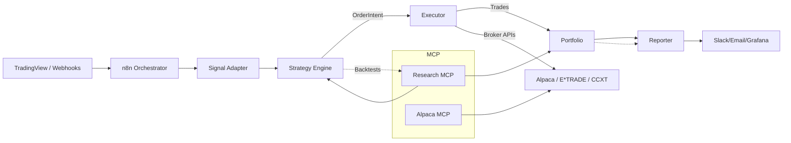
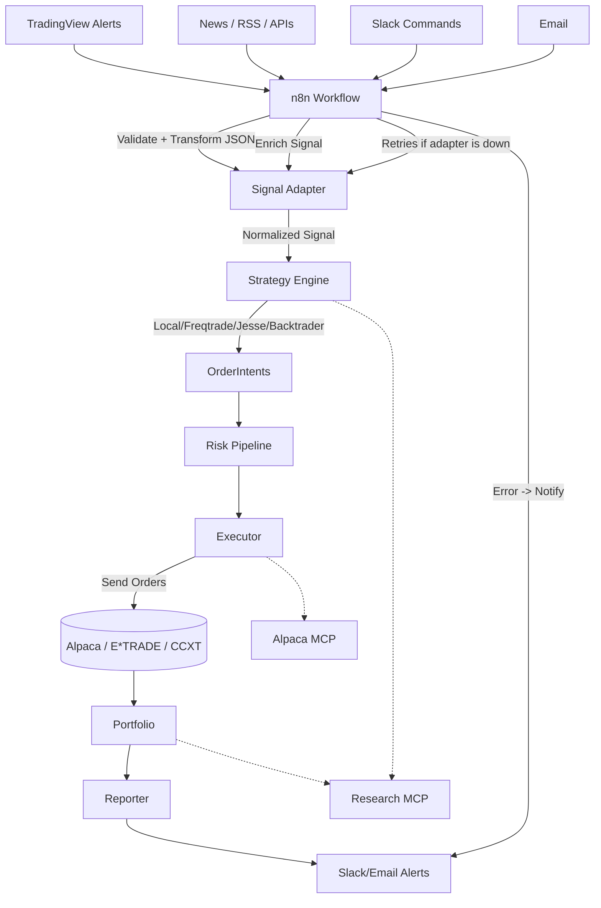

## Architecture

### Apps
- **orchestrator/** → Workflow hub (n8n integration).
- **signal-adapter/** → Thin boundary for incoming signals (validate + persist).
- **strategy-engine/** → Wrapper around Freqtrade, Jesse, Backtrader (strategy runtime).
- **executor/** → Executes orders on brokers/exchanges via adapters.
- **portfolio/** → Central ledger for trades, positions, balances.
- **reporter/** → Reports, dashboards, alerts.
- **mcp-servers/**
  - **alpaca-mcp/** → AI-safe Alpaca adapter.
  - **research-mcp/** → AI research assistant (backtests, data analysis).

### Packages
- **common/** → Shared pydantic models (`Signal`, `OrderIntent`, `Trade`, etc.).
- **risk/** → Risk rules (exposure caps, daily loss limits).
- **storage/** → Persistence (SQLAlchemy, TimescaleDB, Redis).
- **analytics/** → Metrics and reporting (QuantStats, Pandas).
- **brokers/**
  - **alpaca-adapter/** → Wraps `alpaca-py`.
  - **etrade-adapter/** → Wraps E*TRADE API.
  - **ccxt-adapter/** → Wraps CCXT for crypto exchanges.

---

## 🔗 System Overview




### N8N Orchestration



```mermaid
flowchart TD
    subgraph Agents["🤖 AI Subagents"]
        A1[📈 Market Analyst Agent\n(Fundamentals, Sentiment, News)]
        A2[🎯 Strategy Agent\n(EMA, Markov, Reinforcement)]
        A3[💰 Position Sizer Agent\n(Risk-based sizing)]
        A4[🕒 Timing Agent\n(Entry / Exit / Rebalance decisions)]
        A5[🧾 Governance Agent\n(Safety rules, risk policy approval)]
    end

    subgraph MCP["⚙️ MCP Server / Strategy Engine"]
        M1[Signal Aggregator]
        M2[Risk Validator]
        M3[OrderIntent Generator]
        M4[Redis Stream: order_intents]
    end

    subgraph Executor["🚀 Executor / Consumer"]
        E1[Consume OrderIntent]
        E2[Submit to Alpaca]
        E3[Log Trade in DuckDB]
    end

    subgraph Broker["💹 Alpaca"]
        B1[Execute Order]
        B2[Send Webhooks & Positions]
    end

    subgraph Automation["🔄 n8n Orchestrator"]
        N1[Cron / Trigger Agents]
        N2[Rebalance Portfolio]
        N3[Notify via Discord / Slack]
    end

    subgraph Visualization["📊 TradingView / Dashboard"]
        V1[AI-500 Index]
        V2[Performance vs SPY]
    end

    A1 --> A2 --> A3 --> A4 --> A5 --> M1
    M1 --> M2 --> M3 --> M4
    M4 --> E1 --> E2 --> B1
    B1 --> B2 --> E3 --> V1
    N1 --> A1
    N2 --> M1
    N3 --> V2
```
