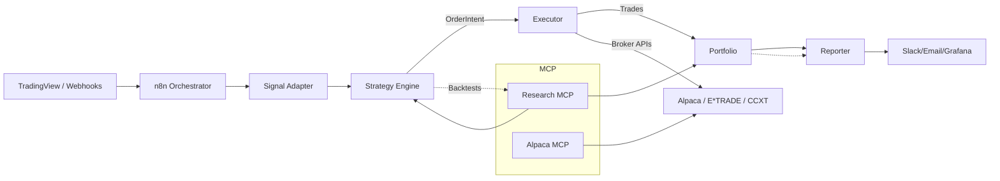

### Apps
- **orchestrator/** → Workflow hub (n8n integration).
- **signal-adapter/** → Thin boundary for incoming signals (validate + persist).
- **strategy-engine/** → Wrapper around Freqtrade, Jesse, Backtrader (strategy runtime).
- **executor/** → Executes orders on brokers/exchanges via adapters.
- **portfolio/** → Central ledger for trades, positions, balances.
- **reporter/** → Reports, dashboards, alerts.
- **mcp-servers/**
  - **alpaca-mcp/** → AI-safe Alpaca adapter.
  - **research-mcp/** → AI research assistant (backtests, data analysis).

### Packages
- **common/** → Shared pydantic models (`Signal`, `OrderIntent`, `Trade`, etc.).
- **risk/** → Risk rules (exposure caps, daily loss limits).
- **storage/** → Persistence (SQLAlchemy, TimescaleDB, Redis).
- **analytics/** → Metrics and reporting (QuantStats, Pandas).
- **brokers/**
  - **alpaca-adapter/** → Wraps `alpaca-py`.
  - **etrade-adapter/** → Wraps E*TRADE API.
  - **ccxt-adapter/** → Wraps CCXT for crypto exchanges.

---

## 🔗 System Overview

